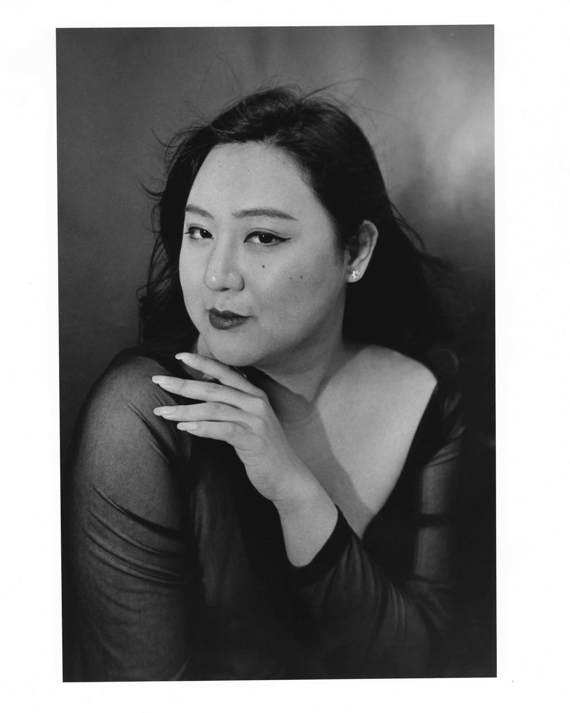
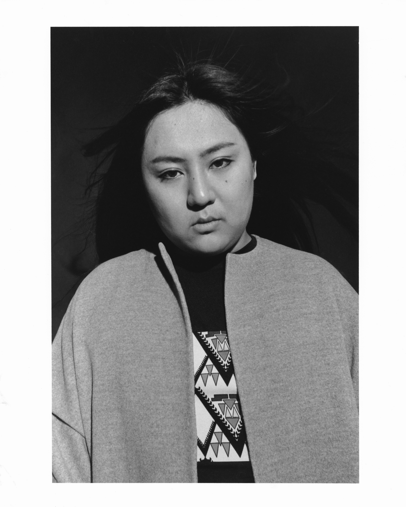
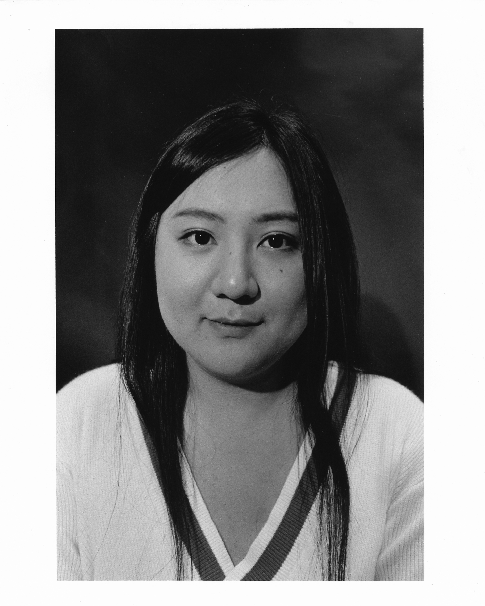
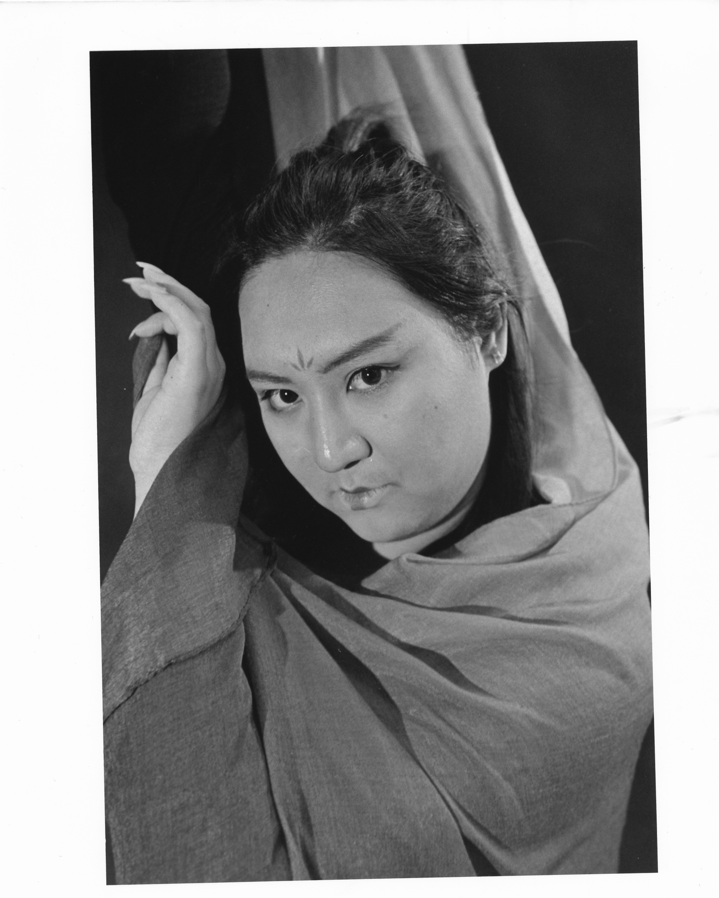
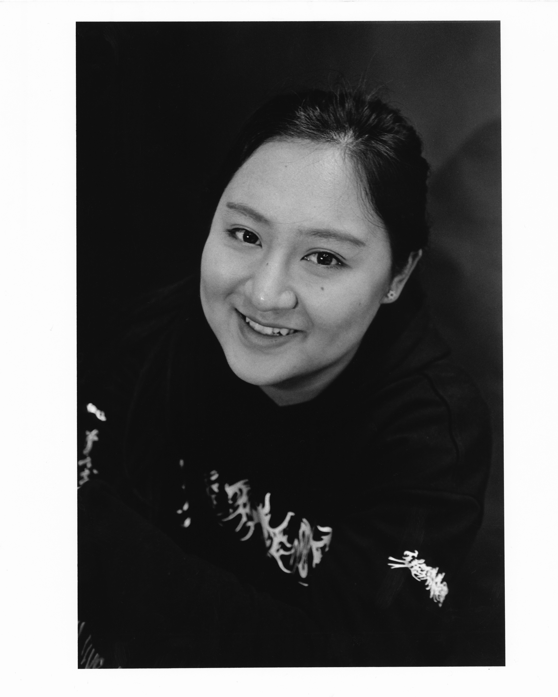
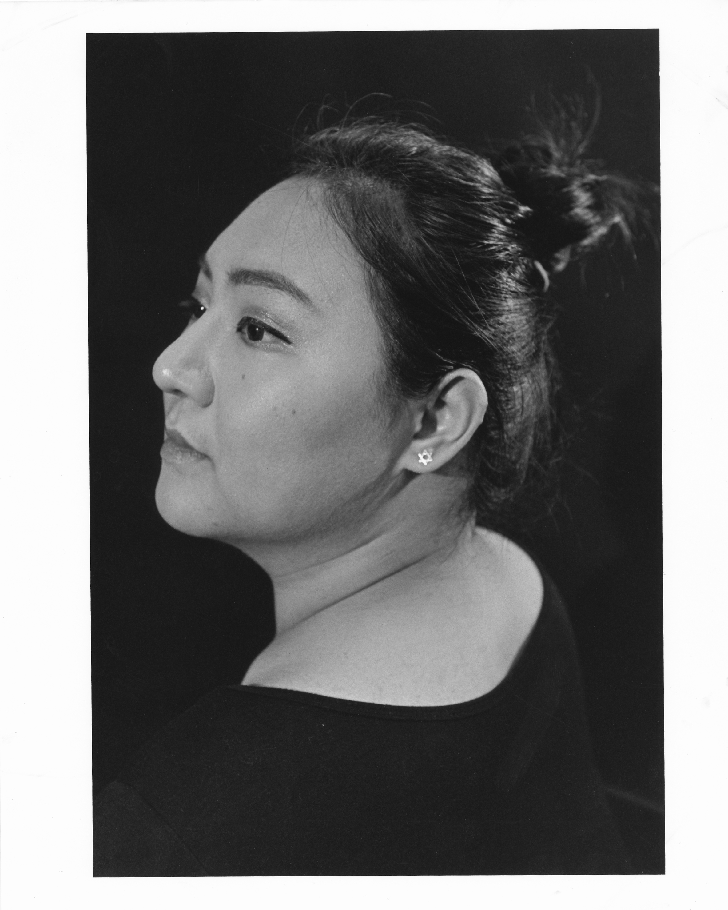
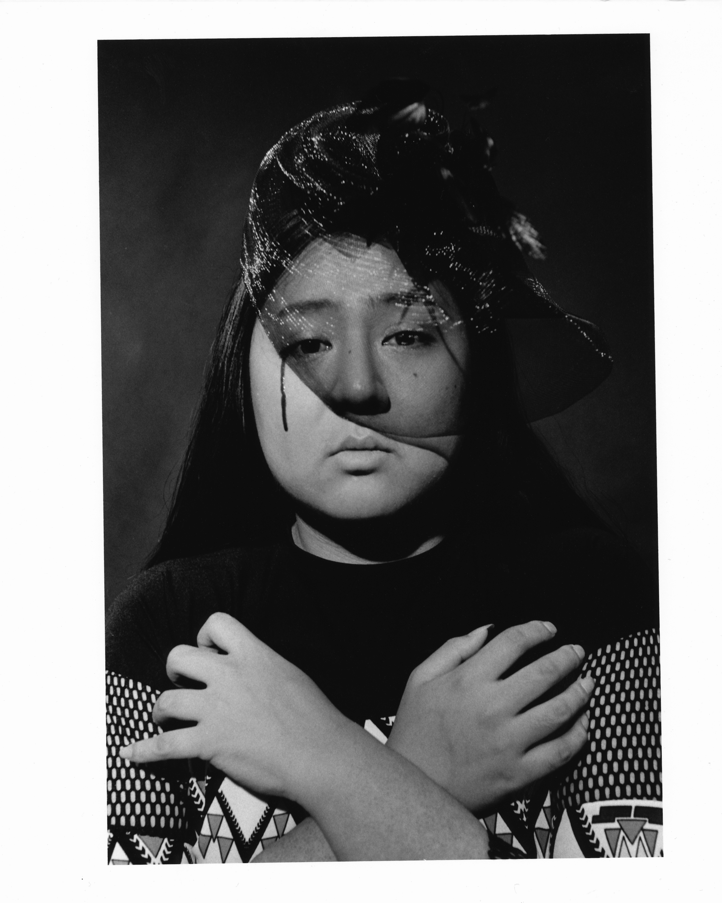
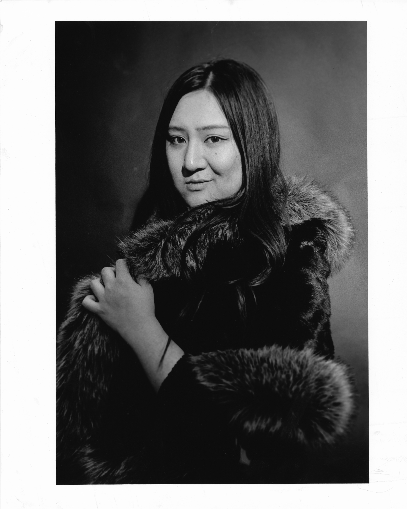
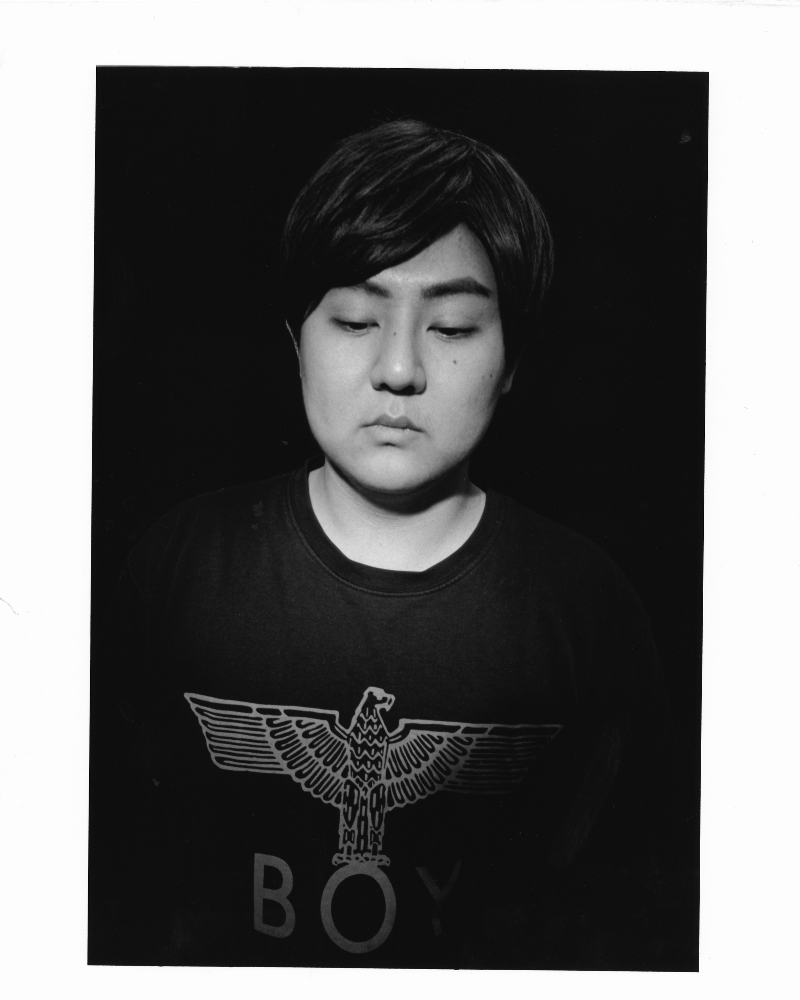

Shuyu Zhang Portfolio Statement
This is a set of photoshop-free photos taken with a film camera. The main protagonist is an ordinary student at Purdue University yet with extraordinary identity - transgender. There was a quite long period that I did not know how to describe Fang. As an Asian, international student and transgender, there are too many labels placed on her. Getting along with her, I found various aspects of her that make Fang stand out and be such different from others. I attempt to show the different emotional feelings I saw in Fang, a representation of the minority that is not concerned by mainstream society and media, through ten photos, including arrogant, confuse, indifferent, happiness evil, pure, sexy, elegant, sad, and nature. At the end, I realize, in fact, these ten emotions not only belong to minority groups, but also belong to everybody. Just like Fang, she is special, and she is common.

